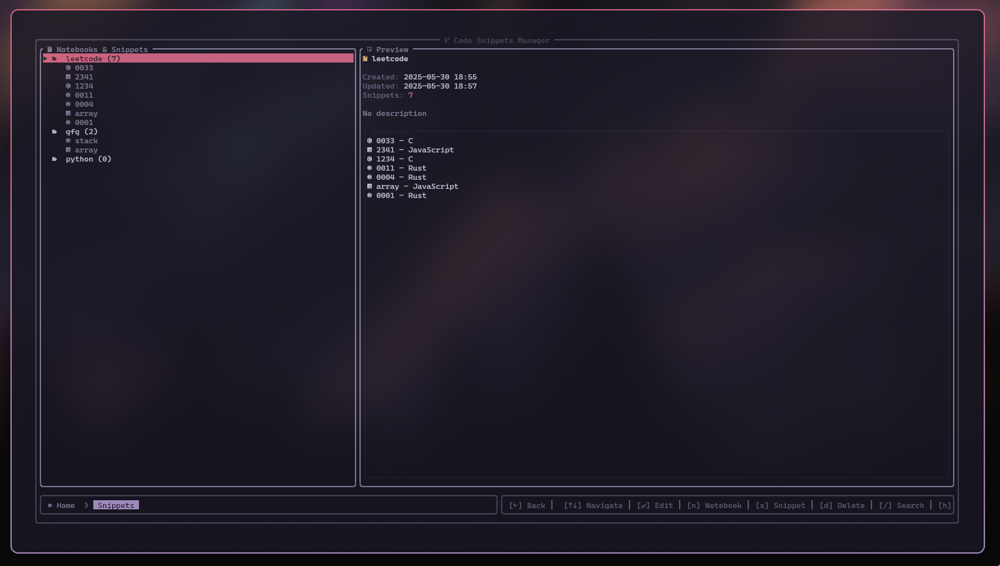
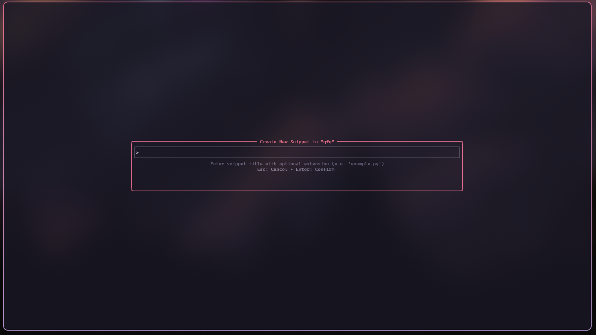
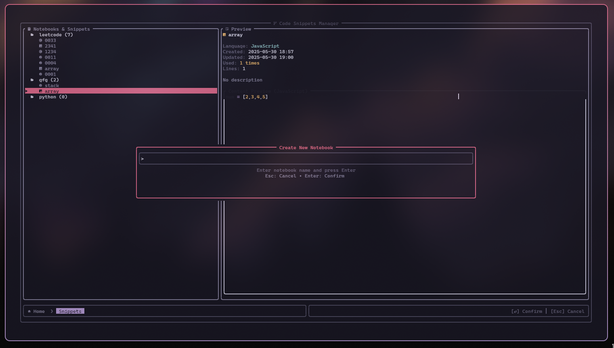

<div align="center">

 ## Snix ⚡
 **Fast terminal-based boilerplate and code snippet manager for developers**
</div>

<div align="center">
  
[](https://www.rust-lang.org/)
[](LICENSE)
[](#)

</div>

Snix is a modern, fast, and intuitive terminal user interface for managing development boilerplates, project templates, and code snippets. Built with Rust and powered by [ratatui](https://github.com/ratatui-org/ratatui), it provides developers with a centralized tool to streamline their development workflow.

## 🎨 Screenshots

| Home with recents | Snippets | New Snippets |
|:-:|:-:|:-:|
|  |  | 

| WIP Tab | New Notebook | Saved |
|:-:|:-:|:-:|
|  |  | 

### Current Status

Snix is currently in **active development**. The core navigation and UI framework are complete, with individual feature pages showing work-in-progress dialogs. Each page will be implemented with full functionality in upcoming releases.

## 🛠️ Development
### Building from Source

```bash
# Clone and navigate
git clone https://github.com/parazeeknova/snix.git
cd snix

# Check code quality (optional)
cargo check

# Run with debug info
cargo run

# Build optimized release
cargo build --release
```

## 🤝 Contributing

We welcome contributions! Here's how you can help:

### Getting Started

1. **Fork** the repository
2. **Clone** your fork: `git clone https://github.com/yourusername/snix.git`
3. **Create** a feature branch: `git checkout -b feature/amazing-feature`
4. **Make** your changes
5. **Test** thoroughly: `cargo test && cargo check`
6. **Commit** with clear messages: `git commit -m 'Add amazing feature'`
7. **Push** to your branch: `git push origin feature/amazing-feature`
8. **Create** a Pull Request

### 📝 License

This project is licensed under the **MIT License** - see the [LICENSE](LICENSE) file for details.

---

<div align="center">

**Star this repository if you find it helpful!**

[Report Bug](https://github.com/parazeeknova/snix/issues) · [Request Feature](https://github.com/parazeeknova/snix/issues) · [Contribute](CONTRIBUTING.md)

*Built with ❤️ and Rust 🦀*

</div>
