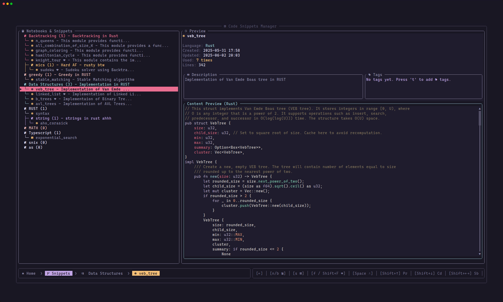

# Snix


<sub><sub>z</sub></sub><sub>z</sub>z

Snix is a extremely fast code snippets & boilerplate manager (soon!) for your terminal. Inspired by Nap, Create and manage notebooks, snippets, and boilerplates with ease. Snix is designed to be fast, efficient, and user-friendly text-user interface, making it the perfect tool for developers who want to streamline their workflow in terminal.

<br />

<p align="center">

</p>

<br />

## Features
- **Extremely fast**: Snix is built with performance in mind, ensuring that you can access your snippets quickly.
- **Ollama Support**: Inbuilt Ollama support, talk to your snippet, using your local llms.
- **Create and manage notebooks**: Organize your snippets into notebooks for better categorization.
- **Create and manage snippets**: Add, edit, and delete snippets with ease.
- **Search snippets**: Quickly find snippets using fuzzy search.
- **Text-based user interface**: Navigate through your snippets and notebooks with a simple and intuitive interface.
- **Command line interface**: Access all features through a powerful command line interface.
- **Favorites**: Mark snippets as favorites for quick access.
- **Recents**: View recently used snippets for quick retrieval using keybinds.
- **Preview snippets**: View snippets in a readable format before using them.
- **Export/Import**: Easily export and import your snippets and notebooks for backup or sharing.
- **Backup**: Automatically backup your snippets and notebooks to prevent data loss also supports auto backup.

## Text-based User Interface
Launch the interactive interface:

```bash
snix
```


<br />

Ollama support: 

```bash
Press `l` on any snippet
```


<br />

## Command Line Interface

List notebooks/snippets:

```bash
# List entire tree of notebooks/snippets
snix list / ls

# List snippets in current notebook
snix list <notebook_name>

# List all notebooks
snix list notebooks
```


Search for snippets:

```bash
# Search for snippets globally
snix search <query>
# Supports fuzzy search
```


List your favorite snippets / Preview a snippet:

```bash
snix list favorites / fav

# Preview a snippet using the snippet name
snix show / view <snippet_name>

# Preview a snippet using snippet ID
snix show / view  <snippet_id>
```


## Installation

Build from source:

```bash
git clone https://github.com/parazeeknova/snix.git
cd snix
cargo run
```
or using make:

```bash
cd snix
make install
```

Or if you prefer to build and run Snix is using Docker Compose:

```bash
# Build and run the container
docker-compose up -d

# Attach to the running container
docker attach snix
```

Building and Running with Docker Directly,
If you prefer to use Docker commands directly:

```bash
# Build the Docker image
docker build -t snix .

# Run the container
docker run -it --name snix snix
```

- The container is configured to run in interactive mode with a TTY to support the terminal UI.
- The application is installed to `/root/.local/bin/` inside the container.
- If you encounter any issues with terminal rendering:
- Make sure your terminal supports 256 colors
- Try running with an explicit TERM setting:

```bash
docker run -it -e TERM=xterm-256color --name snix snix
```

To exit the application, use the key combination defined in the application (typically 'q' or Ctrl+C).

## Screenshot

<br />

<p align="center">
  
</p>

<br />

## License

[MIT](https://github.com/parazeeknova/snix/blob/master/LICENSE)

## Feedback

I'd love to hear your feedback on improving `snix`.

Feel free to reach out via:
* [Twitter](https://x.com/hashcodes_)
* [GitHub issues](https://github.com/parazeeknova/snix/issues/new)

---

<sub><sub>z</sub></sub><sub>z</sub>z
