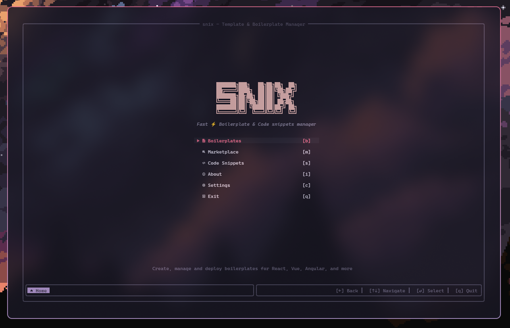
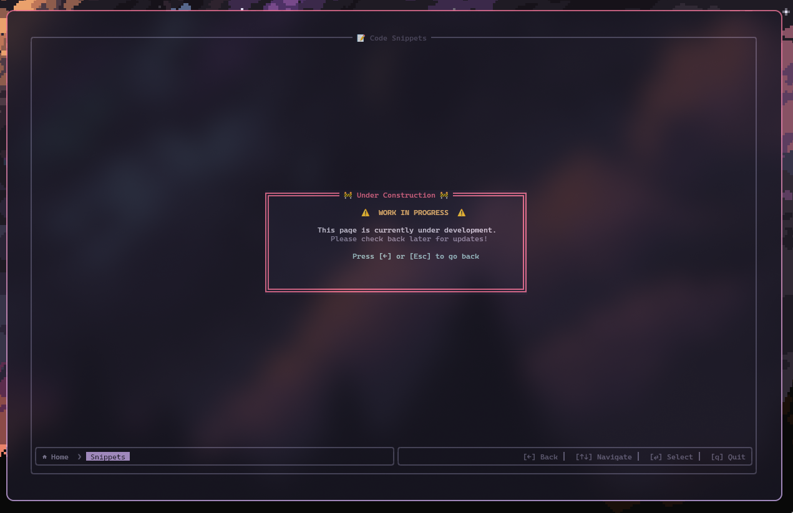

# 🔨 RustUI - BoilerForge for all your templates and snippets

> **A beautiful terminal-based boilerplate and code snippet manager for developers**

[](https://www.rust-lang.org/)
[](LICENSE)
[](#)

RustUI (BoilerForge) is a modern, fast, and intuitive terminal user interface for managing development boilerplates, project templates, and code snippets. Built with Rust and powered by [ratatui](https://github.com/ratatui-org/ratatui), it provides developers with a centralized tool to streamline their development workflow.

## ✨ Features

### 🎯 Current Features
- **Beautiful TUI Interface**: Clean, modern terminal interface with Rose Pine color scheme
- **Intuitive Navigation**: Vi-style keyboard navigation (hjkl) + arrow keys
- **Responsive Design**: Adapts to different terminal sizes
- **Breadcrumb Navigation**: Clear navigation path with back/forward support
- **Keyboard Shortcuts**: Quick access with single-letter shortcuts

### 🚀 Planned Features
- **📦 Boilerplate Management**: Create, organize, and deploy project templates --> React, Vue, Angular, Next.js, Nuxt, SvelteKit templates
  --> Full-stack solutions (Tanstack, MEAN, MERN, T3)
  --> Backend frameworks (Express, NestJS, FastAPI, Rails)
  --> Mobile development (React Native, Flutter, Tauri)

- **🛒 Template Marketplace**: Browse and download community templates
  --> Curated collection of high-quality boilerplates from github
  -->  Community ratings and reviews

- **📝 Code Snippet Manager**: Store and organize reusable code
  --> Syntax highlighting for multiple languages (lsp)
  --> Tag-based organization (ripgrep)
  --> Quick search and filter capabilities (fzf)

- **⚙️ Advanced Configuration**: Customize your workflow
  --> Custom template creation
  --> Personalized shortcuts
  --> Theme customization

## 🎨 Screenshots

| Start Page| WIP page|
|:-:|:-:|
|  |  |

### Current Status

RustUI is currently in **active development**. The core navigation and UI framework are complete, with individual feature pages showing work-in-progress dialogs. Each page will be implemented with full functionality in upcoming releases.

## 🛠️ Development

### Prerequisites
- **Rust**: 1.70 or higher ([Install Rust](https://rustup.rs/))
- **Terminal**: Any modern terminal with Unicode support

### Building from Source

```bash
# Clone and navigate
git clone https://github.com/parazeeknova/rustyui.git
cd rustyui

# Check code quality
cargo check
cargo clippy
cargo fmt

# Run with debug info
cargo run

# Build optimized release
cargo build --release
```

### Dependencies

RustUI is built with modern, well-maintained Rust crates:

- **[ratatui](https://github.com/ratatui-org/ratatui)**: Terminal user interface framework
- **[crossterm](https://github.com/crossterm-rs/crossterm)**: Cross-platform terminal manipulation
- **[color-eyre](https://github.com/yaahc/color-eyre)**: Beautiful error reporting
- **[serde](https://github.com/serde-rs/serde)**: Serialization framework
- **[chrono](https://github.com/chronotope/chrono)**: Date and time handling
- **[uuid](https://github.com/uuid-rs/uuid)**: UUID generation

## 🤝 Contributing

We welcome contributions! Here's how you can help:

### Getting Started

1. **Fork** the repository
2. **Clone** your fork: `git clone https://github.com/yourusername/rustyui.git`
3. **Create** a feature branch: `git checkout -b feature/amazing-feature`
4. **Make** your changes
5. **Test** thoroughly: `cargo test && cargo check`
6. **Commit** with clear messages: `git commit -m 'Add amazing feature'`
7. **Push** to your branch: `git push origin feature/amazing-feature`
8. **Create** a Pull Request

### 📝 License

This project is licensed under the **MIT License** - see the [LICENSE](LICENSE) file for details.

### Acknowledgments

- **[Rose Pine](https://rosepinetheme.com/)** - For the beautiful color palette
- **[ratatui](https://github.com/ratatui-org/ratatui)** - For the excellent TUI framework
- **Rust Community** - For the amazing ecosystem and support

---

<div align="center">

**⭐ Star this repository if you find it helpful!**

[Report Bug](https://github.com/parazeeknova/rustyui/issues) · [Request Feature](https://github.com/parazeeknova/rustyui/issues) · [Contribute](CONTRIBUTING.md)

*Built with ❤️ and Rust 🦀*

</div>