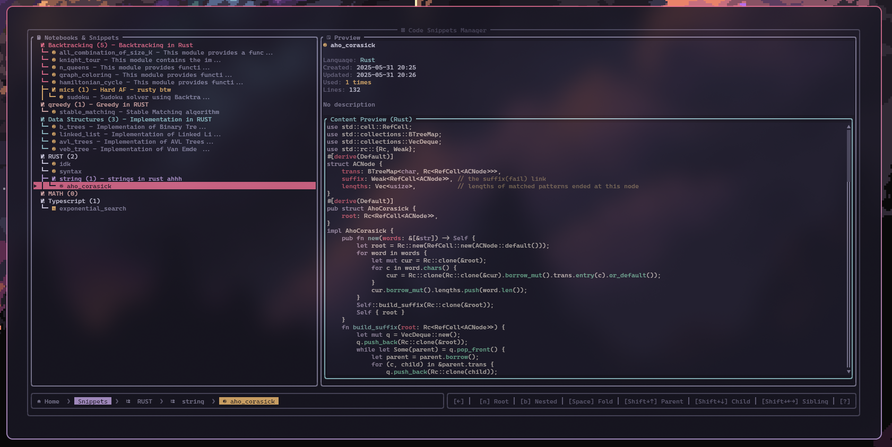
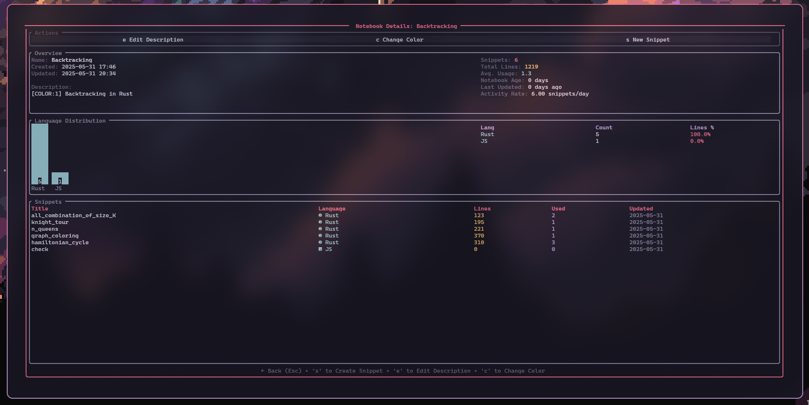
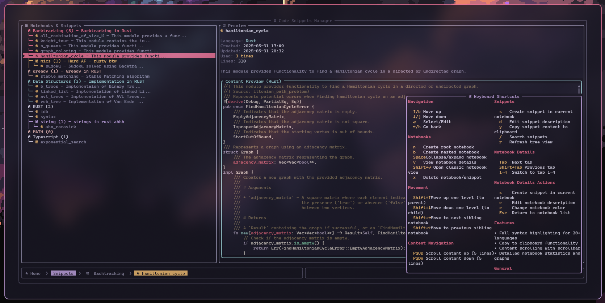
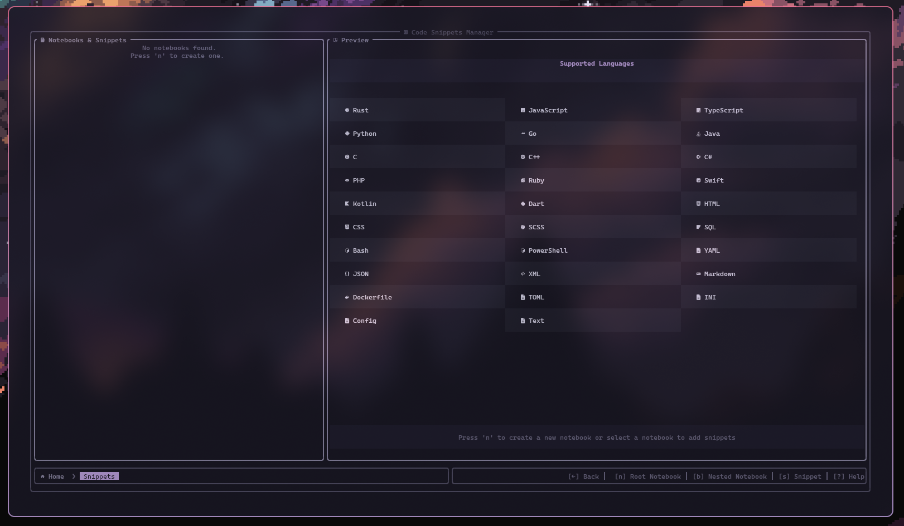

# Snix


<sub><sub>z</sub></sub><sub>z</sub>z

Extremely fast, lightweight code snippets manager for developers, built with Rust for terminal

## 🎨 Screenshots

| Home with recents | Snippets | New Snippets |
|:-:|:-:|:-:|
|  |  | 

| Notebook Details | Actions | blank snippet |
|:-:|:-:|:-:|
|  |  | 

### Current Status

Snix is currently in **active development**. The core navigation and UI framework are complete, with individual feature pages showing work-in-progress dialogs. Each page will be implemented with full functionality in upcoming releases.

## 🛠️ Development
### Building from Source

```bash
# Clone and navigate
git clone https://github.com/parazeeknova/snix.git
cd snix

# Check code quality (optional)
cargo check

# Run with debug info
cargo run # or make run

# Build optimized release
cargo build --release # or make release && make install to install globally
```

## 🤝 Contributing

We welcome contributions! Here's how you can help:

### Getting Started

1. **Fork** the repository
2. **Clone** your fork: `git clone https://github.com/yourusername/snix.git`
3. **Create** a feature branch: `git checkout -b feature/amazing-feature`
4. **Make** your changes
5. **Test** thoroughly: `cargo test && cargo check`
6. **Commit** with clear messages: `git commit -m 'Add amazing feature'`
7. **Push** to your branch: `git push origin feature/amazing-feature`
8. **Create** a Pull Request

### 📝 License

This project is licensed under the **MIT License** - see the [LICENSE](LICENSE) file for details.

---

<div align="center">

**Star this repository if you find it helpful!**

[Report Bug](https://github.com/parazeeknova/snix/issues) · [Request Feature](https://github.com/parazeeknova/snix/issues) · [Contribute](CONTRIBUTING.md)

*Built with ❤️ and Rust 🦀*

</div>
